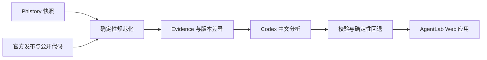

# AgentLab

> 面向 Coding Agent 开发者的中文变更情报站。

[在线体验](https://agentlab.dairui1.com) · [GitHub 仓库](https://github.com/dairui1/agentlab)

Web 界面开发遵循 [设计约定](DESIGN.md)，包括专题详情、长文章、机制工作台及移动端的共同验收要求。

AgentLab 持续跟踪 Claude Code、Codex、OpenCode、Pi、OpenClaw、Goose、Cline、Qwen Code、DeepSeek Harness、Exo、Reasonix 等 Coding Agent 与 Agent Harness 的公开变化，把运行时 Prompt、Tools、静态 Prompt、官方发布说明与公开代码变化整理成可检索、可追溯的中文情报。

这个项目不是 Agent 排行榜，也不把模型生成内容当成事实。每条重要结论都应回到公开来源、版本和实际差异，并明确区分事实证据、工程观察与模型推断。

## 主要功能

- **更新情报**：按 Agent、信号类型和重要性筛选近期变化。
- **版本比较**：比较实际请求、Prompt 结构和 Tools，保留逐行证据。
- **专题研究**：用固定版本证据回答会改变 Agent 工程判断的问题；先给结论和工程后果，再展开事实、推断边界与未知项。
- **多源证据**：组合 Phistory 快照、官方 changelog、GitHub Releases、npm 发布与公开代码比较结果。
- **中文解读**：生成重要性、变化摘要和对自研 Agent 的启示；模型不可用时保留确定性回退结果。

## 数据链路



1. `sync_phistory.py` 增量同步 [Phistory](https://github.com/WEIFENG2333/phistory) 收录的 Agent 快照。
2. `sync_official_sources.py` 同步官方 changelog、GitHub Releases、npm 发布和有界代码比较结果；只有发布包映射、没有可靠 commit/tag 的来源不会冒充完整源码比较。
3. `sync_source_captures.py` 将尚无运行时快照的官方发布物化为 source-only Capture。
4. `build_from_phistory.py` 规范化版本、请求正文、Tools、静态 Prompt 与多源 evidence。
5. `analyze_changelogs.py` 为发生变化的版本生成中文摘要、重要性和工程启示。
6. `daily_update.py` 串联同步、构建、分析、测试与 Cloudflare 部署。

## 用自己的 Codex 运行

需要 Node.js 22 或更高版本、Python 3.11 或更高版本，以及已经登录的 Codex CLI。先确认 Codex 可用：

```bash
codex login status
```

从一个全新的 clone 开始，最短路径是：

```bash
cd apps/agent-history
npm ci
npm run local
npm run dev
```

`npm run local` 只稀疏同步 Codex 数据和对应官方来源，默认选取最新 5 个待分析版本，调用当前用户已登录的 `codex exec`，随后合并结果、运行测试并构建站点。缓存、Evidence、分析结果和构建产物都留在本地，不进入 Git。

可以调整 Agent、模型和分析数量，例如：

```bash
npm run local -- --agents codex --max-releases 10 --reasoning-effort high
```

初次运行不需要下载整个 AgentLab 数据集。`codex` 的 Phistory Capture 当前约为十几 MB；脚本还会按需获取其官方 Release、Changelog 和有界代码比较。选择 `claude-code` 或 `all` 会明显增加同步量。

流水线在同步前检查 Codex 登录状态。Codex 未安装、未登录，或者某个模型分析未通过本地 JSON Schema 与证据校验时，`npm run local` 会失败，而不会悄悄把确定性回退结果冒充成 Codex 分析。

需要自己控制各阶段时可以运行：

```bash
npm run sync
npm run build:data
npm run analyze -- --agents codex --newest-first --max-releases 5
npm run build
npm test
```

`npm run sync` 会在官方来源同步完成后物化 source-only Capture，因此全新缓存也可直接交给 `npm run build:data`。

### ZCode 与 MiniMax Code

2026-09-21 核验后，两项开源 Harness 已接入同一套官方来源同步、source-only Capture、证据分析和日更链路：

- `zcode` 对应 [zai-org/ZCode](https://github.com/zai-org/ZCode)，根许可证为 Apache-2.0。核验时没有公开 tag 或 GitHub Release，因此跟踪有界 commit 快照，而不是把桌面端 `3.14.0` 或 CLI workspace `0.16.9` 当成正式发布。源码入口是 `apps/zcode-cli/packages/core/src/`，包含 Agent turn machine、工具执行、权限和压缩模块。
- `minimax-code-cli` 对应 [MiniMax-AI/minimax-code](https://github.com/MiniMax-AI/minimax-code)，从官方 `v0.5.0` release/tag 开始跟踪。第一方代码默认 MIT；第三方组件保留各自许可，详见官方 `LICENSE-STATUS.md`。源码包含 `packages/local-runtime-v2`、`packages/agent-modules` 与独立 Prompt 模板。
- MiniMax 只展示一个 **MiniMax Code** 入口（内部 ID `minimax-code-cli`）。旧桌面版 `3.0.x` 采集保留在原始来源和本地缓存，不再作为并列产品进入目录。旧 `minimax-code` 页面参数会转到当前入口，但旧版本号不会与 CLI `0.x` 混排。

source-only 条目不表示已捕获真实模型请求。静态 Prompt 文件、公开工具实现与 Runtime Prompt/Tool Schema 是不同证据；缺少运行时采集时仍明确标记缺失，不从源码伪造运行时快照。首次只有一个 release 的项目也没有相邻版本源码差异，后续版本才会自动累积比较证据。

这两个项目的最新源码另有有界文件采集：按 release 对应的 commit 固定获取 Prompt、工具契约/实现、Turn、权限与压缩文件，保留全文、文件路径、SHA-256 和官方链接。详情页直接展示源码，不再只显示缺失请求的空面板。源码基线可进入更新情报，但不计作 Runtime Prompt 或 Tool Schema 的增删。

ZCode 的本地图标复制自[官方仓库固定提交](https://github.com/zai-org/ZCode/blob/872ad960de7ec172591f7e1952f7849229f94521/public/logo/icons/128x128.png)，仅用于标识被跟踪产品。

`npm run analyze` 只处理 Evidence 已变化且缺少有效分析的版本。普通 `npm run daily` 面向无人值守发布，Codex 分析失败时允许确定性回退；完整日更流程的安全边界和参数见 [`apps/agent-history/ops/README.md`](apps/agent-history/ops/README.md)。

生成的 `public/`、`dist/` 和 `analysis/` 可从已同步的数据重建；`.cache/official-sources/` 还保存有界代码比较的历史账本，应像发布状态一样备份，不能在普通更新前删除。数据来源、版本、摘要以及 Evidence Digest 会写入生成的 `public/data/manifest.json` 和 Changelog JSON，外部用户不需要信任仓库作者机器上的缓存。

## Raft 协作基础设施研究

[Raft 多智能体博客](https://agentlab.dairui1.com/capabilities/raft-multi-agent) 左侧完整保留 Tenny 的 AX 文章中文译文与五张官网配图，右侧按段落展开九则长篇研究：19 段固定源码、9 幅机制图，追踪收件箱、可见性、发送检查、草稿恢复、任务认领和待验证实验。代码片段逐行核对固定版本，图示不冒充运行记录；手机上下衔接，可关闭批注连续读原文。依委托人转述的作者许可发布中文翻译，不刊载英文全文。原架构研究页保留不变。

新文来源核验：在 `apps/agent-history` 执行 `node scripts/verify_raft_sources.mjs --study=raft-multi-agent --fetch`；离线可用 `--source-tree <固定源码目录>`。该命令只检查文件哈希和行号，不执行 Raft。

[Raft 专题](https://agentlab.dairui1.com/capabilities/raft-collaboration) 沿消息可见性、任务认领、runtime 恢复和权限边界，分析官方 `v1.13.0-source.1` 发布镜像，固定公开提交 `05f7d8fd77d2535f993d5d90b85118438bc18216`。研究数据含 18 条文件证据与 6 项未知问题，可从专题索引和全站导航进入。

这是 FSL-1.1-ALv2 的 source-available 项目，不按宽松开源 Coding Agent 归类。当前只收录固定版本研究，未接入自动版本日更或持续监控，也没有把静态 Prompt 伪装成 Runtime Prompt 捕获。未安装 Raft、未运行上游测试或多 Agent 实验；AgentLab 测试只验证本站的数据和界面。

从 `apps/agent-history` 运行 `node scripts/verify_raft_sources.mjs --fetch`，可按固定 commit 重新读取证据文件并校验 SHA-256、行号范围和来源链接；不会执行或安装上游代码。网络失败和文件不匹配都会返回失败，不降级成已验证。已有平铺文件缓存时可用 `--source-dir <目录>` 离线校验。上游全文仅保留在忽略的本地缓存中，公开内容为原创分析、定位与哈希，上游许可证不受 AgentLab 的 MIT 许可替代。

## Agent 数据访问

项目内置 [`agentlab-update-feed`](.codex/skills/agentlab-update-feed/SKILL.md) skill，指导 Agent 组合 `feedAgent`、`signal`、`priority` 等 filter，将公开更新情报输出为 Markdown，并沿 manifest 获取指定版本的原始 Prompt Markdown。skill 安装后只访问 `agentlab.dairui1.com` 的公开数据，不依赖本仓库 checkout。

安装到当前项目，并在交互提示中选择要使用的 Agent：

```bash
npx skills add https://github.com/dairui1/agentlab/tree/main/.codex/skills/agentlab-update-feed
```

全局安装给 Codex，可在任意项目中使用：

```bash
npx skills add https://github.com/dairui1/agentlab/tree/main/.codex/skills/agentlab-update-feed \
  --global --agent codex --yes
```

安装后直接告诉 Agent，例如：“使用 `agentlab-update-feed` 查询 Codex 最近 10 条高价值 Tools 更新，并返回 Markdown。”Agent 会从线上 manifest 和 feed 组合 filter，不需要克隆本仓库。

在本仓库开发或调试 skill 时，也可以直接运行内置脚本：

```bash
node .codex/skills/agentlab-update-feed/scripts/query-feed.mjs \
  --filter 'feedAgent=codex&signal=tools&priority=high&limit=10&format=markdown'
```

## 写作语气

项目里也放了一份 [`de-ai-ify`](.codex/skills/de-ai-ify/SKILL.md) skill。研究文章、交互提示、证据说明和报错文案在发布前都要照着它过一遍：少说套话，多讲清楚“哪一步、出了什么事、读者接下来能做什么”。口语化不能拿来糊弄事实，尤其不能编造个人经历，也不能把文件里的静态线索写成已经亲手跑通的结果。

仓库运维使用 [`agentlab-release-ops`](.codex/skills/agentlab-release-ops/SKILL.md) skill。它把每日流水线的 launchd 核查、上游与官方源码同步、AI 队列门禁、安全恢复、测试构建、Wrangler 发布和双域 manifest 验收收在同一套流程里。这个 skill 需要 AgentLab checkout 和本机发布环境，不是面向公开 feed 的只读查询器。

## 仓库结构

```text
agentlab/
  apps/agent-history/
    public/             # Web 应用源码与静态资源
      capabilities/    # 固定构建研究数据与兼容详情页
      dossiers/        # 跨 Agent 比较研究数据与证据
    scripts/            # 同步、规范化、分析、构建和发布脚本
    tests/              # Python 与 Node.js 测试
    ops/                # 本机日更自动化
```

生成的上游缓存、公开数据产物、Evidence、AI 分析和构建目录不提交到 Git。它们可以从相同的公开来源和脚本重新生成。

## 证据与安全边界

- 只使用公开、可引用、用户自有或明确允许保存的材料。
- 不提交账号 Token、内部日志、私有工作区内容、非公开系统提示词或未授权泄露源码。
- 来源事实、产品观察、工程推断和待验证问题必须分层表达。
- 已安装产品研究必须钉住构建版本与文件摘要；打包产物不是上游源码，组件存在也不等于运行路径已命中。
- 上游快照被视为不可信输入；构建过程限制文件类型、大小、路径和产物范围。
- 模型分析不等同于上游声明，应用会单独标记推断和确定性证据。

## 参与项目

欢迎修正错误事实和失效来源、接入新的官方证据、改进数据流水线，以及优化更新情报和版本比较体验。提交前请阅读 [`CONTRIBUTING.md`](CONTRIBUTING.md)。

## 许可证

AgentLab 使用 [MIT License](LICENSE) 开源。

## 致谢

- [Phistory](https://github.com/WEIFENG2333/phistory) 提供跨 Agent 的公开版本快照。
- 各 Agent 的官方文档、公开仓库和发布记录构成 AgentLab 的主要事实来源。

AgentLab 与被研究的 Agent 项目及其厂商没有隶属或背书关系。项目中出现的名称和商标归各自权利人所有。
