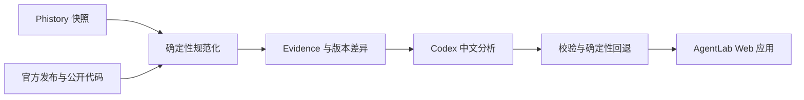

# AgentLab

> 面向 Coding Agent 开发者的中文工程知识库与变更情报站。

[在线体验](https://agentlab.dairui1.com) · [GitHub 仓库](https://github.com/dairui1/agentlab)

AgentLab 持续跟踪 Claude Code、Codex、OpenCode、Pi 等 Coding Agent 的公开变化，把运行时 Prompt、Tools、静态 Prompt、官方发布说明与公开代码变化整理成可检索、可追溯的中文情报。项目也沉淀开发 Agent 时反复遇到的工程问题，包括工具协议、权限与沙箱、上下文、缓存、评测、发布和研究方法。

这个仓库不是 Agent 排行榜，也不把模型生成内容当成事实。我们的目标是让每条重要结论都能回到公开来源、版本和实际差异，并明确区分事实证据、工程观察与模型推断。

## 能做什么

- **跨 Agent 变更追踪**：查看不同 Agent 最近发生了什么，以及哪些变化值得开发者关注。
- **版本比较**：比较实际请求、Prompt 结构和 Tools，保留可复查的逐行证据。
- **多源证据融合**：组合 Phistory 快照、官方 changelog、GitHub Releases 与公开代码比较结果。
- **中文工程解读**：生成重要性、变化摘要和对自研 Agent 的启示；模型失败时使用确定性回退结果。
- **Agent 工程手册**：整理工具、环境、提示词、上下文、缓存、评测与安全边界。
- **可复现流水线**：同步、规范化、分析、测试和部署均由仓库中的脚本完成。

## 在线应用

[agentlab.dairui1.com](https://agentlab.dairui1.com) 是当前生产应用，提供两种主要视图：

- **更新情报**：按 Agent、信号类型和重要性筛选近期变化。
- **版本比较**：查看实际请求、结构、Tools、官方证据和逐版本摘要。

生产应用位于 [`apps/agent-history`](apps/agent-history)。仓库中的 [`site`](site) 是面向 Agent 工程知识的文档站源码，目前不是生产域名的发布入口。

## 数据链路



1. `sync_phistory.py` 增量同步 [Phistory](https://github.com/WEIFENG2333/phistory) 收录的 Agent 快照。
2. `sync_official_sources.py` 同步已接入的官方 changelog、GitHub Releases 和有界代码比较结果。
3. `build_from_phistory.py` 规范化版本、请求正文、Tools、静态 Prompt 与多源 evidence；这一阶段不依赖模型。
4. `analyze_changelogs.py` 为发生变化的版本生成中文摘要、重要性和工程启示。
5. `daily_update.py` 串联同步、构建、分析、测试与 Cloudflare 部署。

Phistory 是上游事实来源之一；AgentLab 的数据模型、分析规则、界面和发布链路独立实现。

## 快速开始

### 校验研究目录

需要 Python 3.11 或更高版本：

```bash
python3 -m pip install -e .
agentlab validate
agentlab list
agentlab show codex
```

也可以不安装，直接从源码运行：

```bash
PYTHONPATH=src python3 -m agentlab validate
```

### 运行变更情报应用

需要 Node.js 22 或更高版本、Python 3.11 或更高版本。首次构建会同步公开上游数据：

```bash
cd apps/agent-history
npm ci
npm run sync
npm run build
npm test
npm run dev
```

`npm run analyze` 会调用本机 Codex，只处理 evidence 已变化且缺少有效分析的版本。它是可选步骤；没有模型结果时，构建仍会生成确定性摘要。

完整日更流程使用 `npm run daily`。本机 `launchd` 安装和运维说明见 [`apps/agent-history/ops/README.md`](apps/agent-history/ops/README.md)。

### 构建文档站

```bash
cd site
npm ci
npm run build
```

## 仓库结构

```text
agentlab/
  apps/agent-history/   # 生产变更情报应用
  apps/agent-native/    # Agent-native actions 控制面
  agent/                # action、job、policy 和 trace 协议
  data/                 # Agent、Prompt 来源和同步目标索引
  docs/                 # 研究方法、路线图和模板
  research/             # 架构研究、Prompt 记录和专题研究
  generated/            # 可审查的生成索引和同步清单
  scripts/              # 内容生成与公开来源同步脚本
  site/                 # Agent 工程文档站
  src/agentlab/         # Python CLI
  tests/                # Catalog 与工具测试
```

## 证据与安全边界

- 只使用公开、可引用、用户自有或明确允许保存的材料。
- 不提交账号 Token、内部日志、私有工作区内容、非公开系统提示词或未授权泄露源码。
- 来源事实、产品观察、工程推断和待验证问题必须分层表达。
- Prompt 研究优先保存结构、类别、版本变化和影响，而不是无差别复制全文。
- 上游快照被视为不可信输入；构建过程限制文件类型、大小、路径和产物范围。
- 模型分析不等同于上游声明，站点会单独标记推断和确定性证据。

更多规则见 [`docs/methodology.md`](docs/methodology.md) 和 [`agent/policies/source-boundaries.md`](agent/policies/source-boundaries.md)。

## 参与项目

当前项目处于早期公开阶段，接口、数据格式和目录仍可能调整。欢迎通过 Issue 提交以下内容：

- 错误事实、失效来源或版本归属问题。
- 新的官方来源和可复现证据。
- Agent 工程案例、实验组件和数据管线改进。
- 安全、隐私、版权和供应链风险报告。

提交代码前请先运行与改动相关的测试。涉及研究正文时，需要同时提供来源并标明证据等级。

## 许可证

AgentLab 使用 [MIT License](LICENSE) 开源。

## 致谢

- [Phistory](https://github.com/WEIFENG2333/phistory) 提供跨 Agent 的公开版本快照。
- 各 Agent 的官方文档、公开仓库和发布记录构成 AgentLab 的主要事实来源。

AgentLab 与被研究的 Agent 项目及其厂商没有隶属或背书关系。项目中出现的名称和商标归各自权利人所有。
