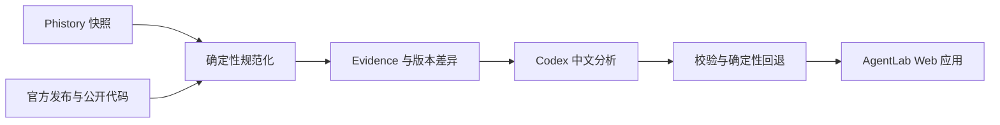

# AgentLab

> 面向 Coding Agent 开发者的中文变更情报站。

[在线体验](https://agentlab.dairui1.com) · [GitHub 仓库](https://github.com/dairui1/agentlab)

AgentLab 持续跟踪 Claude Code、Codex、OpenCode、Pi、OpenClaw、Goose、Cline、Qwen Code 等 Coding Agent 的公开变化，把运行时 Prompt、Tools、静态 Prompt、官方发布说明与公开代码变化整理成可检索、可追溯的中文情报。

这个项目不是 Agent 排行榜，也不把模型生成内容当成事实。每条重要结论都应回到公开来源、版本和实际差异，并明确区分事实证据、工程观察与模型推断。

## 主要功能

- **更新情报**：按 Agent、信号类型和重要性筛选近期变化。
- **版本比较**：比较实际请求、Prompt 结构和 Tools，保留逐行证据。
- **多源证据**：组合 Phistory 快照、官方 changelog、GitHub Releases 与公开代码比较结果。
- **中文解读**：生成重要性、变化摘要和对自研 Agent 的启示；模型不可用时保留确定性回退结果。

## 数据链路



1. `sync_phistory.py` 增量同步 [Phistory](https://github.com/WEIFENG2333/phistory) 收录的 Agent 快照。
2. `sync_official_sources.py` 同步官方 changelog、GitHub Releases 和有界代码比较结果。
3. `build_from_phistory.py` 规范化版本、请求正文、Tools、静态 Prompt 与多源 evidence。
4. `analyze_changelogs.py` 为发生变化的版本生成中文摘要、重要性和工程启示。
5. `daily_update.py` 串联同步、构建、分析、测试与 Cloudflare 部署。

## 本地运行

需要 Node.js 22 或更高版本、Python 3.11 或更高版本。首次构建会同步公开上游数据：

```bash
cd apps/agent-history
npm ci
npm run sync
npm run build
npm test
npm run dev
```

`npm run analyze` 会调用本机 Codex，只处理 evidence 已变化且缺少有效分析的版本。该步骤可选；没有模型结果时，构建仍会生成确定性摘要。

完整日更流程使用 `npm run daily`。本机自动化安装和运维说明见 [`apps/agent-history/ops/README.md`](apps/agent-history/ops/README.md)。

## Agent 数据访问

项目内置 [`agentlab-update-feed`](.codex/skills/agentlab-update-feed/SKILL.md) skill，指导 Agent 组合 `feedAgent`、`signal`、`priority` 等 filter，将公开更新情报输出为 Markdown，并沿 manifest 获取指定版本的原始 Prompt Markdown。skill 安装后只访问 `agentlab.dairui1.com` 的公开数据，不依赖本仓库 checkout。

安装到当前项目，并在交互提示中选择要使用的 Agent：

```bash
npx skills add https://github.com/dairui1/agentlab/tree/main/.codex/skills/agentlab-update-feed
```

全局安装给 Codex，可在任意项目中使用：

```bash
npx skills add https://github.com/dairui1/agentlab/tree/main/.codex/skills/agentlab-update-feed \
  --global --agent codex --yes
```

安装后直接告诉 Agent，例如：“使用 `agentlab-update-feed` 查询 Codex 最近 10 条高价值 Tools 更新，并返回 Markdown。”Agent 会从线上 manifest 和 feed 组合 filter，不需要克隆本仓库。

在本仓库开发或调试 skill 时，也可以直接运行内置脚本：

```bash
node .codex/skills/agentlab-update-feed/scripts/query-feed.mjs \
  --filter 'feedAgent=codex&signal=tools&priority=high&limit=10&format=markdown'
```

## 仓库结构

```text
agentlab/
  apps/agent-history/
    public/             # Web 应用源码与静态资源
    scripts/            # 同步、规范化、分析、构建和发布脚本
    tests/              # Python 与 Node.js 测试
    ops/                # 本机日更自动化
```

生成的上游缓存、公开数据产物、Evidence、AI 分析和构建目录不提交到 Git。它们可以从相同的公开来源和脚本重新生成。

## 证据与安全边界

- 只使用公开、可引用、用户自有或明确允许保存的材料。
- 不提交账号 Token、内部日志、私有工作区内容、非公开系统提示词或未授权泄露源码。
- 来源事实、产品观察、工程推断和待验证问题必须分层表达。
- 上游快照被视为不可信输入；构建过程限制文件类型、大小、路径和产物范围。
- 模型分析不等同于上游声明，应用会单独标记推断和确定性证据。

## 参与项目

欢迎修正错误事实和失效来源、接入新的官方证据、改进数据流水线，以及优化更新情报和版本比较体验。提交前请阅读 [`CONTRIBUTING.md`](CONTRIBUTING.md)。

## 许可证

AgentLab 使用 [MIT License](LICENSE) 开源。

## 致谢

- [Phistory](https://github.com/WEIFENG2333/phistory) 提供跨 Agent 的公开版本快照。
- 各 Agent 的官方文档、公开仓库和发布记录构成 AgentLab 的主要事实来源。

AgentLab 与被研究的 Agent 项目及其厂商没有隶属或背书关系。项目中出现的名称和商标归各自权利人所有。
